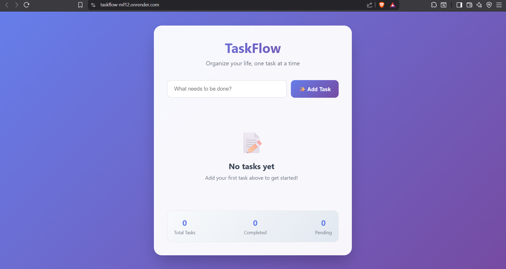

# ✅ TaskFlow — Modern To-Do List Web App

**TaskFlow** is a modern and responsive to-do list web application built to help users manage daily tasks efficiently. It combines a lightweight Python Flask backend with a polished, interactive frontend using HTML, CSS, and JavaScript.

🌐 **Live Demo**: [taskflow-mf12.onrender.com](https://taskflow-mf12.onrender.com/)

---

## 🚀 Features

- ✅ Add, complete, and delete tasks
- 💾 Persistent data storage using `tasks.json`
- 🔁 Real-time updates between frontend and backend via Fetch API
- 🎨 Animated UI feedback for task actions
- 📱 Fully responsive design for mobile and desktop
- 🌐 Cross-origin support using `Flask-CORS`

---

## 🛠️ Tech Stack

### 🔹 Frontend

- HTML5
- CSS3 (with animations)
- JavaScript (Vanilla + Fetch API)

### 🔹 Backend

- Python 3
- Flask (micro web framework)
- Flask-CORS (handles cross-origin requests)
- JSON file storage (`tasks.json` for persistence)

### 🔹 Version Control

- Git
- GitHub

---

## 📸 App Preview

> *(Replace with your actual screenshot or gif after uploading it to your repo)*



---

## 🔧 Getting Started (Run Locally)

To run TaskFlow on your local machine, follow the steps below:

---

### 1. 📥 Clone the Repository

```bash
git clone https://github.com/your-username/taskflow.git
cd taskflow
